# Introduction
Developing English Test website that helps:

* User can learn and do English tests online.
* Admin can manage and provide lessons and tests

# Overview
This section discusses some information about the project. More details are shown in [the report](ApplicationFile/assets/report.pdf).

## Demo
### Sign in/up

### Admin

    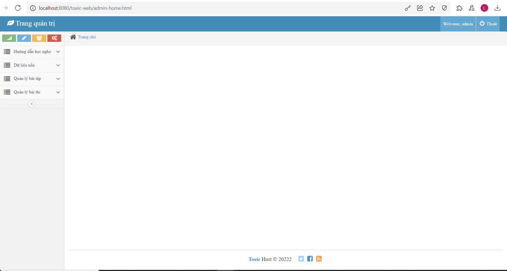
    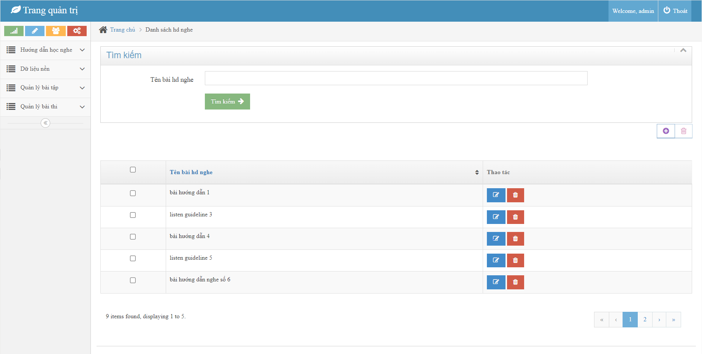

    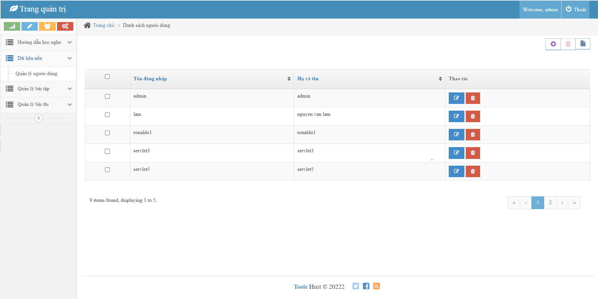
    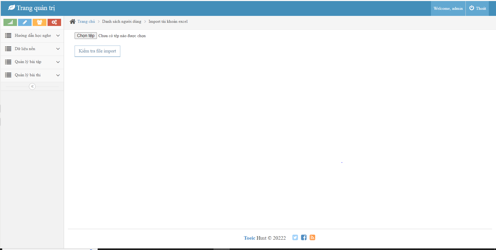

### User

    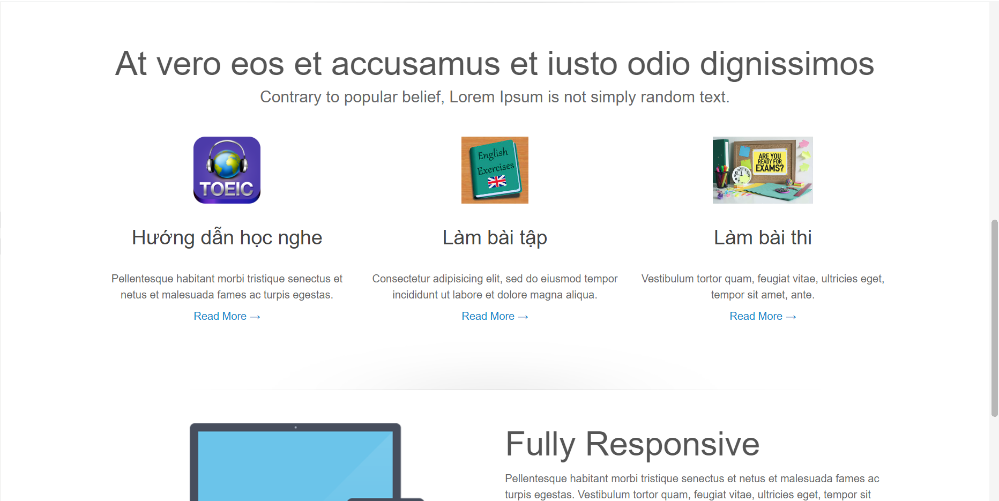
    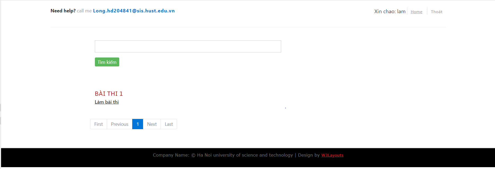
    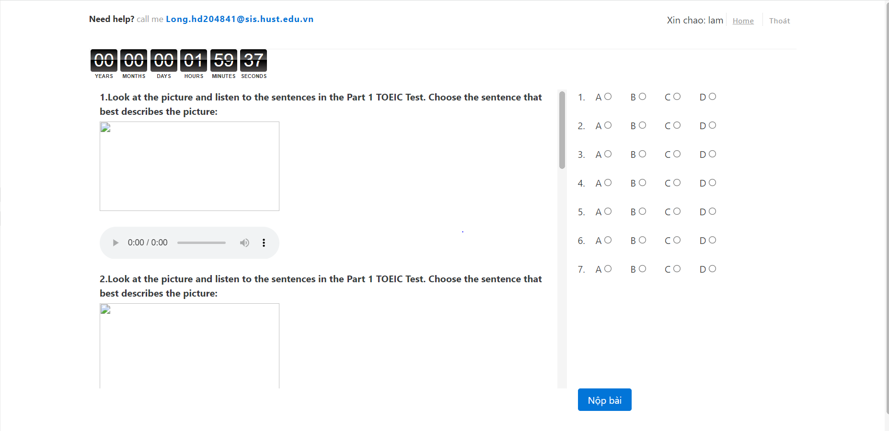

    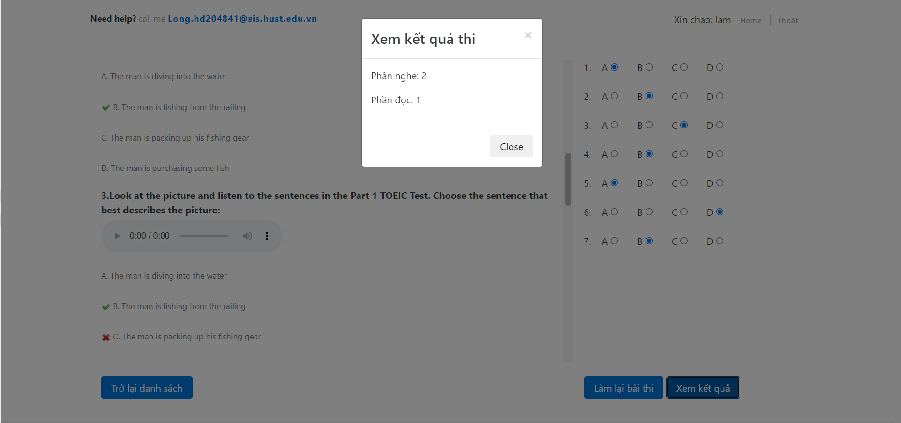
    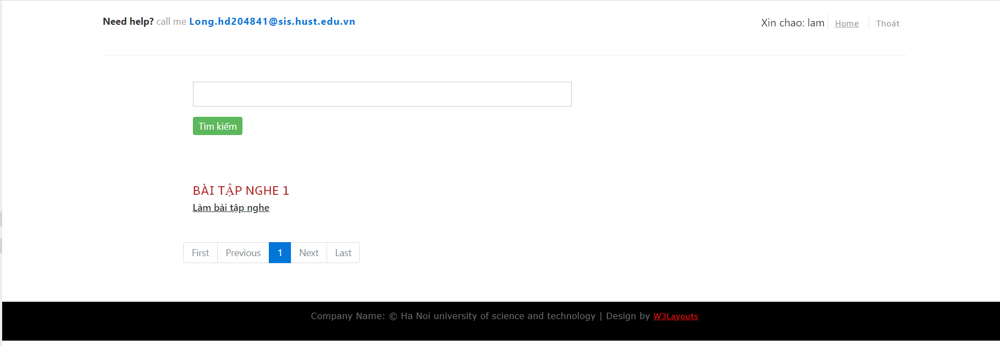
    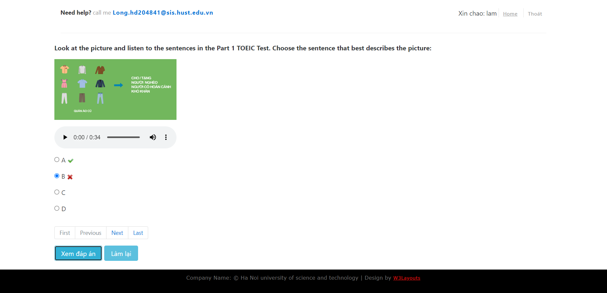

    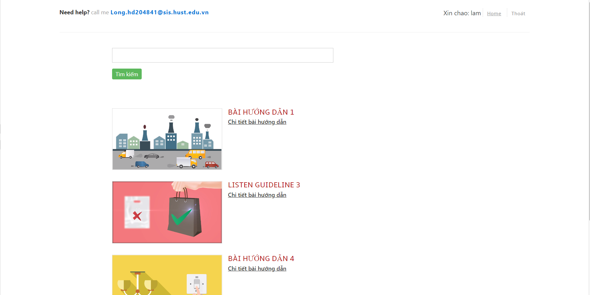
    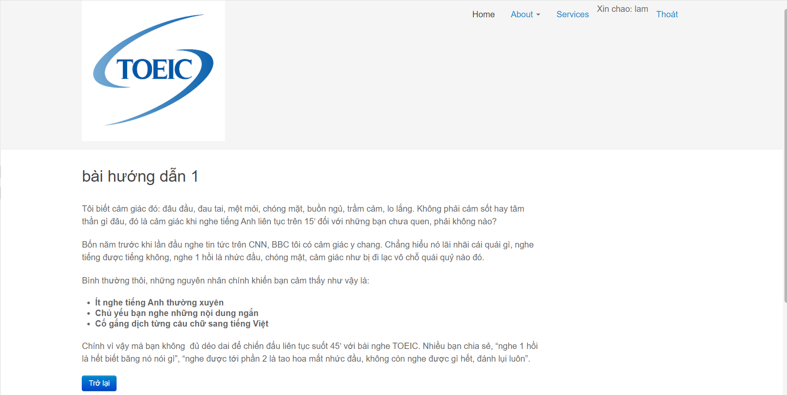

## Database
<figure style="text-align: center;">
    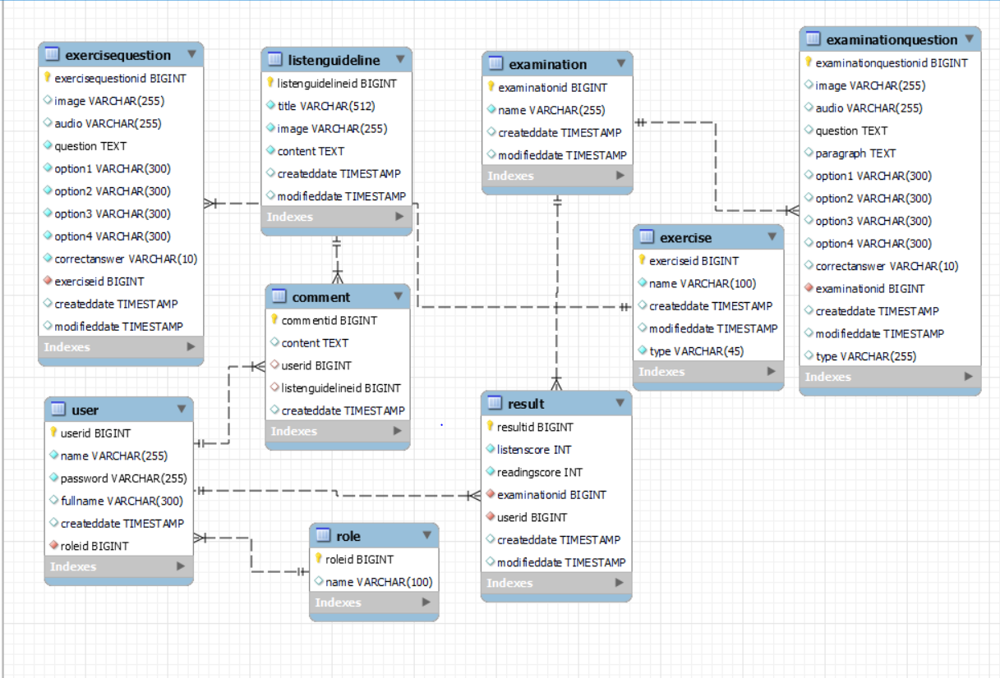
    <figcaption>ER Diagram</figcaption>
</figure>

## Directory organization
<figure style="text-align: center;">
    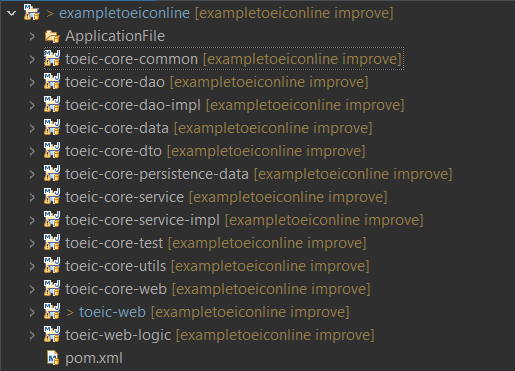
    <figcaption> </figcaption>
</figure>

* [ApplicationFile/database](ApplicationFile/database) contains sql files. Excute them in the order given by their name (ex: 1, 2 ...).
* Business logic: dto, service, dao, utils, data
* View: web
* Controller: web-logic
* Model: persistence

## Design pattern
<b><i>toeic-core-data, toeic-core-dao, toeic-core-dao-impl</i></b>. These three packages are used to implement Data Access Object pattern.

Singleton pattern is implemented by class in different util folder.
